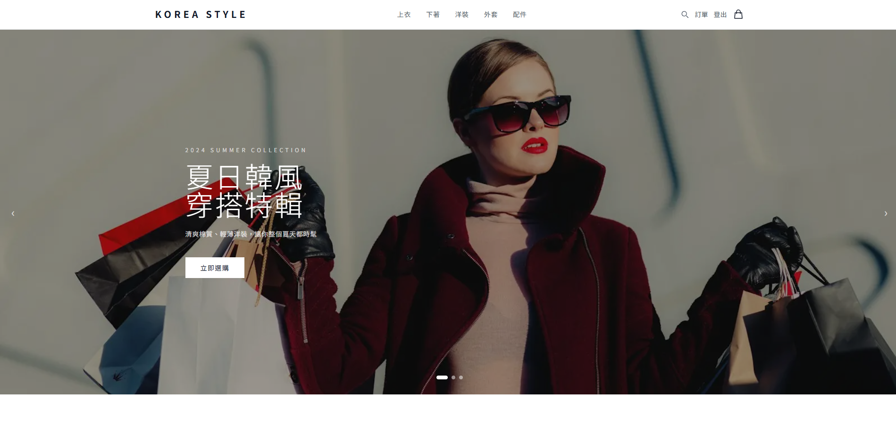
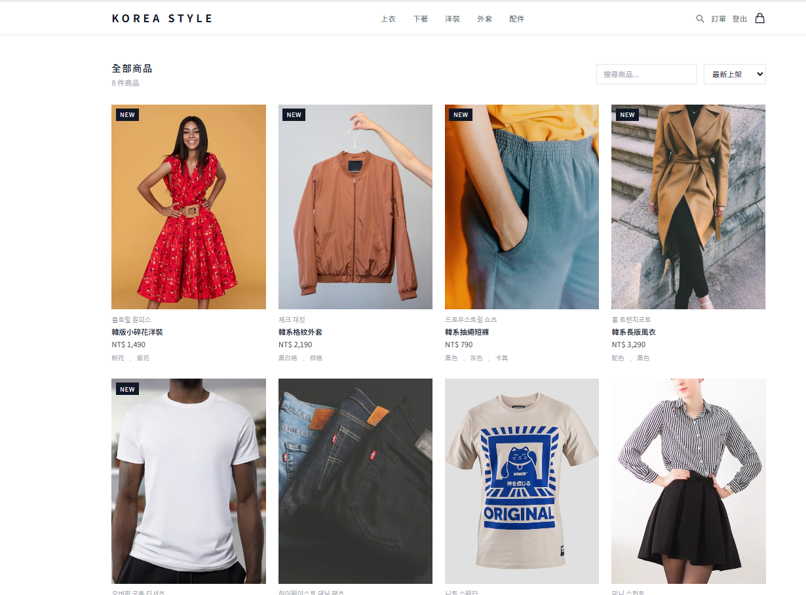
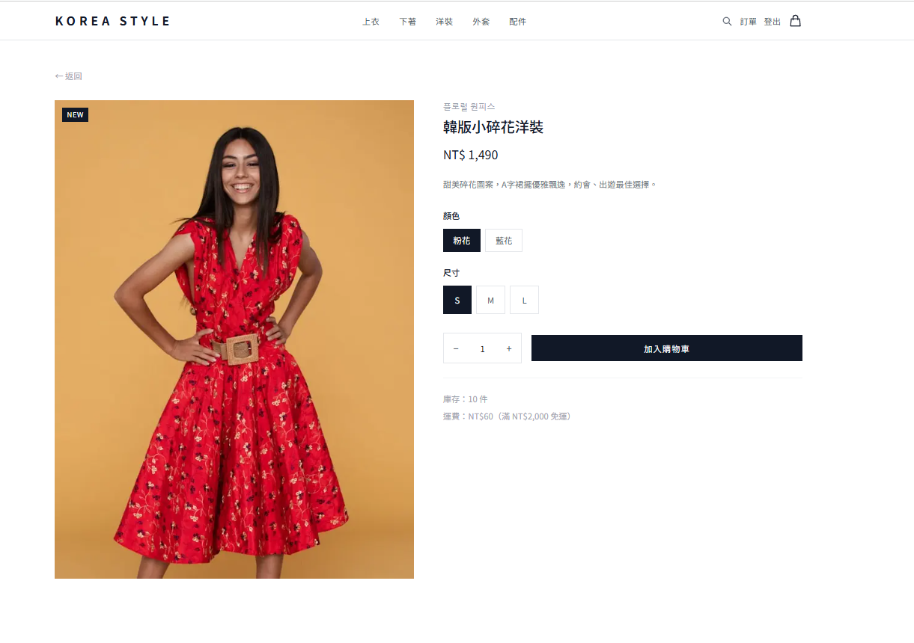
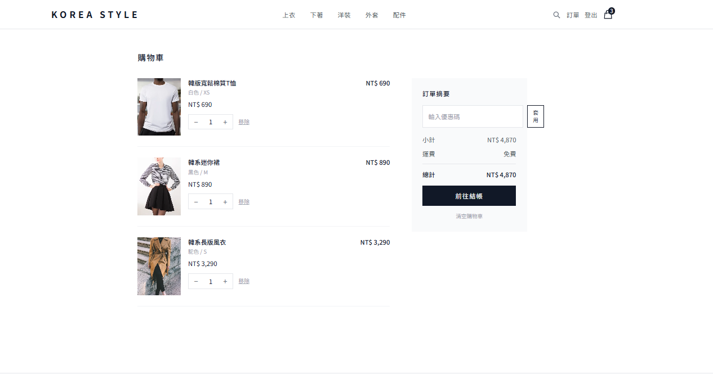

# KOREA STYLE｜韓國流行服飾電商平台

> 精選韓國流行服飾，時尚穿搭一站購足

---

## 畫面預覽

### 首頁


### 商品列表


### 商品詳情


### 購物車


---

## 功能介紹

### 前台（顧客）
- 🏠 **首頁** — Hero 輪播 Banner、分類圖片卡、新品上架、精選商品
- 🛍️ **商品列表** — 依分類篩選、關鍵字搜尋、價格排序
- 👗 **商品詳情** — 圖片展示、顏色 / 尺寸選擇、加入購物車
- 🛒 **購物車** — 數量調整、優惠券折扣、運費計算
- 💳 **結帳** — 填寫收件資訊、確認下單
- 📦 **訂單記錄** — 查看歷史訂單與詳細資訊
- 👤 **會員系統** — 註冊、登入、登出

### 後台（管理員）
- 📊 **儀表板** — 營收趨勢、訂單狀態、熱賣商品、成本/毛利/毛利率
- 📦 **商品管理** — 新增、編輯、刪除、成本與毛利率顯示
- 📋 **訂單管理** — 查看所有訂單、展開明細、更新配送狀態
- 👥 **會員管理** — 搜尋會員、查看消費記錄、停用帳號
- 🎟️ **優惠券** — 建立折扣碼（百分比/固定金額）、設定期限與次數
- 📦 **庫存管理** — 低庫存警示、手動調整庫存、調整記錄
- 🖼️ **Banner 管理** — 新增/編輯/刪除輪播圖片、拖曳排序
- 📈 **進階報表** — 平均客單價、回購率、時段熱度圖、匯出 CSV

---

## 技術架構

| 層級 | 技術 |
|------|------|
| 前端框架 | Next.js 14 (App Router) |
| 前端樣式 | Tailwind CSS |
| 圖表 | Recharts |
| 後端框架 | Node.js + Express |
| 資料庫 | MongoDB + Mongoose |
| 身份驗證 | JWT |
| 安全防護 | Helmet、Rate Limiting、express-validator、XSS Sanitize |

---

## 快速開始

### 前置需求
- Node.js v18+
- MongoDB（本機或 Atlas）

### 1. Clone 專案

```bash
git clone https://github.com/Thexushao/koreastyle.git
cd koreastyle
```

### 2. 啟動後端

```bash
cd backend
npm install
```

建立 `.env` 檔案：

```env
PORT=5000
MONGODB_URI=mongodb://localhost:27017/koreastyle
JWT_SECRET=your_jwt_secret
NODE_ENV=development
```

```bash
npm run seed          # 插入商品假資料
npm run seed:banners  # 插入 Banner 假資料
npm run seed:users    # 插入會員與訂單假資料
npm run dev           # 啟動後端（port 5000）
```

### 3. 啟動前端

```bash
cd frontend
npm install
npm run dev           # 啟動前端（port 3000）
```

開啟瀏覽器前往 [http://localhost:3000](http://localhost:3000)

---

## 測試帳號

### 一般會員（密碼皆為 `test1234`）

| 姓名 | Email |
|------|-------|
| 王小明 | wang@example.com |
| 李美華 | lee@example.com |
| 陳雅婷 | chen@example.com |
| 林志豪 | lin@example.com |
| 張怡君 | chang@example.com |

### 管理員
將帳號的 `isAdmin` 欄位設為 `true` 即可進入後台 `/admin`。
